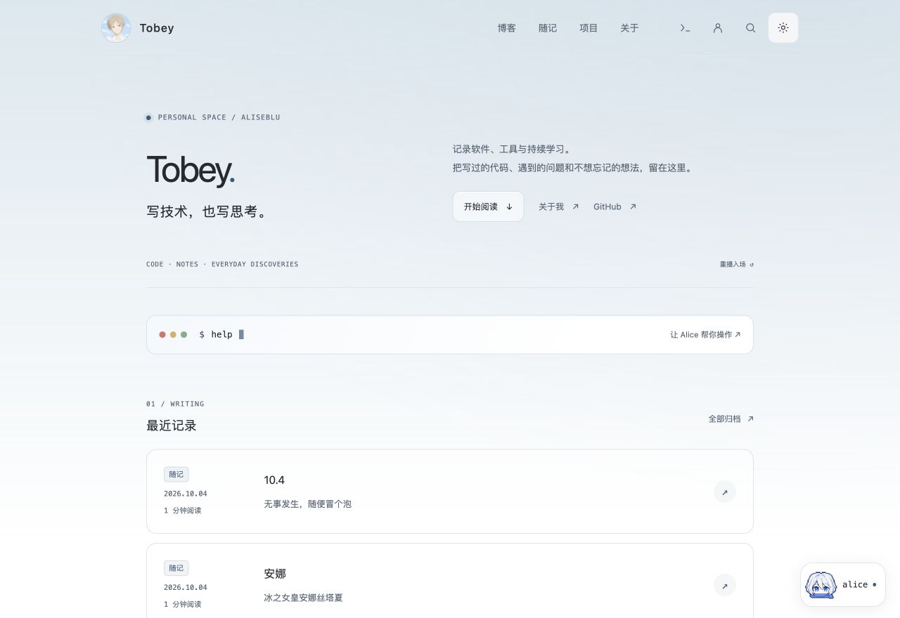

# Hi, I'm Tobey 👋

Web 与 AI 学习者。喜欢把想法做成能真正使用的小工具，也把实践过程认真记录下来。

这里是我的代码空间，[Aliseblu](https://www.aliseblu.cn/) 是我的个人博客。写技术，也写思考；保持好奇，慢慢生长。

### 🌱 最近在做什么

- 打磨 **Aliseblu** 的手机与电脑写作体验，让草稿、素材和发布流程更顺手。
- 完善 **Alice**，从站内问答走向能规划、能执行、也知道权限边界的 Agent。
- 继续探索 **C2Video** 的内容转视频工作流，学习 Web 与 AI 应用工程。

---

### ✦ Aliseblu · 个人博客与写作工作台

<a href="https://www.aliseblu.cn/">
  <picture>
    <source media="(prefers-color-scheme: dark)" srcset="./assets/aliseblu-home-dark.jpg" />
    
  </picture>
</a>

使用 **Astro、TypeScript、Markdown、UnoCSS / CSS** 构建，借助 Supabase 保存私有草稿与验证站长身份，通过 GitHub → Vercel 发布。

- **阅读**：中文全文搜索、内容归档、日夜主题、图片放大、代码换行与本机阅读进度恢复。
- **写作**：站长专属工作台，支持私有草稿、图片与附件、素材库、版本对比、备份和回收站。
- **发布**：区分保存、提交、部署与线上确认；GitHub Actions 检查测试、构建和资源体积。

[进入网站](https://www.aliseblu.cn/) · [随记](https://www.aliseblu.cn/notes/) · [项目](https://www.aliseblu.cn/projects/) · [内容归档](https://www.aliseblu.cn/archive/)

#### Alice · 有边界的站内 Agent

Alice 不只回答问题，也能把请求拆成操作计划，经确认后执行。例如：**“先切换到夜间模式，再搜索 C2Video。”**

明确的导航、搜索、主题切换和开屏重播在本地执行；复杂请求由 DeepSeek 生成最多 4 步的受限计划。站长可以读取自己的短稿、核对新稿与修改建议，再确认保存为私有草稿。

游客不能读取或修改私有内容；私有草稿正文不交给模型，发布和删除仍在工作台确认。

### 🎬 C2Video · 从内容到视频

基于 [X2Video](https://github.com/asashiki/X2Video) 演进的工作流项目，把素材、口播、配音、字幕与视频渲染串联起来，关注持久执行、人工审核和来源追溯。

`Python / FastAPI` · `React / TypeScript` · `SQLite` · `FFmpeg` · `Docker`

[查看项目介绍与界面演示](https://www.aliseblu.cn/projects/c2video/) — 当前公开的是展示页，不是在线生成服务；源码暂不公开。

---

### 🛠 使用中的技术

  
  
  
  
  
  
  

---

### 🐍 一点点积累

<picture>
  <source media="(prefers-color-scheme: dark)" srcset="https://raw.githubusercontent.com/aliseblu/aliseblu/output/github-contribution-grid-snake-dark.svg" />
  <source media="(prefers-color-scheme: light)" srcset="https://raw.githubusercontent.com/aliseblu/aliseblu/output/github-contribution-grid-snake.svg" />
  
</picture>

---

### 📫 找到我

